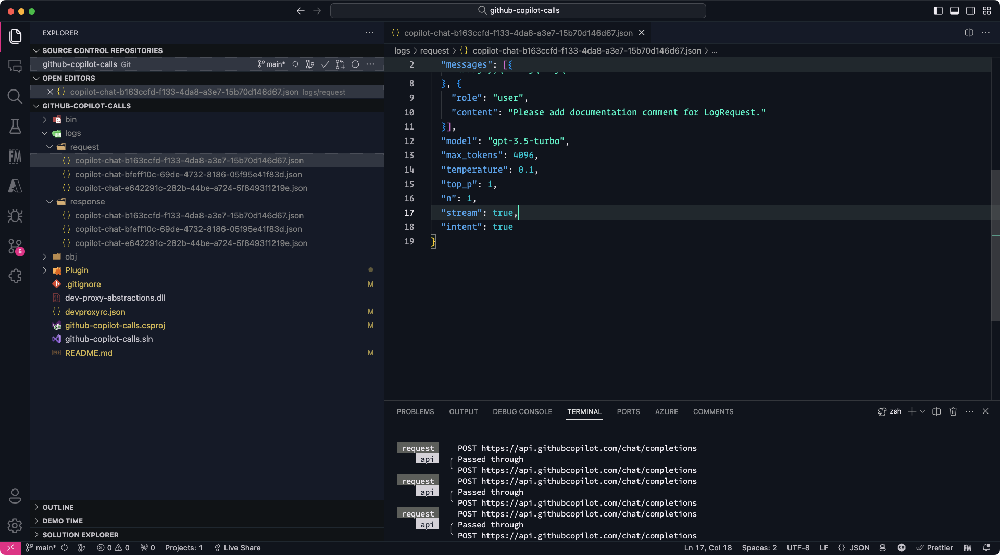

# Using the GitHub Copilot Listener

The GitHub Copilot Listener plugin listens to the GitHub Copilot requests and logs them to a file.



## Prerequisites

- [.NET Core SDK](https://dotnet.microsoft.com/download)
- [Dev Proxy](https://learn.microsoft.com/en-us/microsoft-cloud/dev/dev-proxy/overview)

## Build the plugin

```bash
dotnet build
```

## VSCode configuration

To listen to the GitHub Copilot requests in Visual Studio Code, the Dev Proxy must be running and the following settings must be set in the VSCode **user settings**:

```json
{
  "http.proxy": "http://localhost:8000",
  "http.proxyStrictSSL": false,
}
```

## Dev Proxy Configuration

Use the following configuration for the plugin:

### Plugin instance definition

```json
{
  "name": "GitHubCopilotListenerPlugin",
  "enabled": true,
  "pluginPath": "./bin/Debug/net8.0/github-copilot-calls.dll",
  "configSection": "githubCopilotListener"
}
```

### Configuration example

```json
{
  "githubCopilotListener": {
    "logPath": "./logs"
  }
}
```

### Configuration properties

| Property | Description | Default |
|----------|-------------|--------:|
| `logPath` | The path to which the logs need to be written | `""` |

## Run the Dev Proxy with the plugin

Once you have created your configuration, you can run the Dev Proxy with the plugin as follows:

```bash
devproxy
```

## References

- [GitHub Copilot Firewall settings](https://docs.github.com/en/copilot/troubleshooting-github-copilot/troubleshooting-firewall-settings-for-github-copilot)
- [Network Connections in Visual Studio Code](https://code.visualstudio.com/docs/setup/network)
